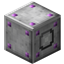

	
	<h1 align="center">Click Machine (Fabric)</h1>
	
Adds a single block that acts like a player's mouse click.

## About
 
Click Machine is a mod that adds one new block to the game - a standalone auto-clicker. It supports 9 configurable speeds, each with their own configurable RF/t cost. There is also the option to hold on item, sneak, and left click. It can click both blocks and entities. More specifically, the auto clicker simulates the click if a player were at the direct center of the block, facing in the direction it is facing, with the default reach distance (5). If it fails to find something to click, it will search blocks for non-air blocks in front of it, and click that.
